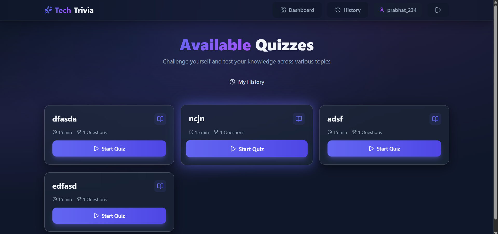
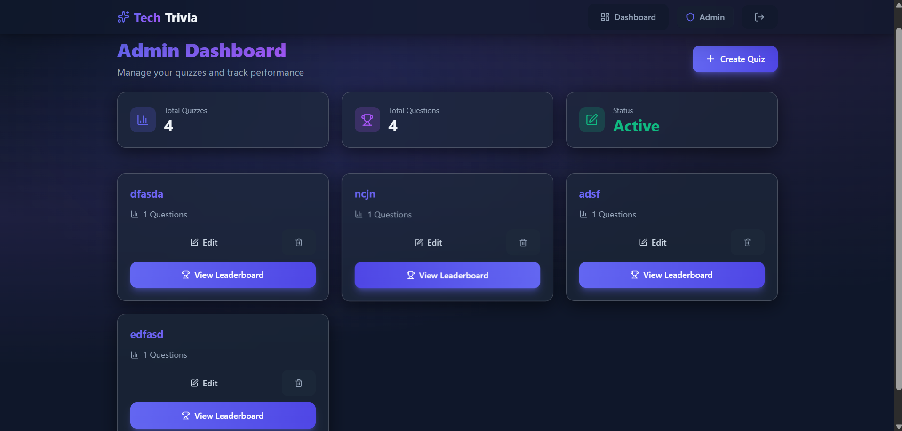

# ⚡ Tech Trivia — Controlled Online Quiz Platform

> **Tech Trivia** is a rule-driven online quiz platform designed to simulate a real examination environment. It prioritizes fairness, discipline, and automatic rule enforcement over casual quiz-taking.

---

## 🧠 Platform Overview

Tech Trivia is a full-stack quiz application where the system—not the user—controls how quizzes are attempted.  
Once a quiz begins, strict constraints are applied to ensure every participant follows the same rules under the same conditions.

The platform supports two roles:
- **Users** — attempt quizzes under enforced rules
- **Admins** — create and manage quiz content

---

## 👤 User Experience

Users access available quizzes through a centralized dashboard. When a quiz is started:

- A **fixed 15-minute timer** begins immediately
- Questions can be navigated freely within the allowed time
- Progress is tracked visually
- The quiz is **automatically submitted** if:
  - Time expires
  - The browser tab is switched
  - The window loses focus or is minimized

Each quiz is **single-attempt only**. Reattempts through refresh, back navigation, or direct URL access are blocked.

After submission, users are redirected to a result summary reflecting their performance.

---

## 🛠 Admin Capabilities

Admins operate through a separate interface that allows full control over quiz content. Admins can:

- Create quizzes
- Add multiple questions per quiz
- Define answer options and correct answers
- Manage quiz data securely

Admin access is isolated from user functionality to maintain content integrity.

Admin can only login when they have the unique Admin Key for security.

---

## 🔒 Integrity & Rule Enforcement

Tech Trivia is built around automatic enforcement of rules rather than user compliance.  
Key integrity mechanisms include:

- Fixed-duration quiz timer
- Auto-submission on focus loss or tab switching
- Attempt locking to prevent multiple submissions
- Navigation and refresh protection

These safeguards work together to replicate real-world online assessment behavior.

---

## 🛠 Technology Stack

### Frontend
- React (Vite)
- Tailwind CSS
- React Router DOM
- Context API
- Axios
- Lucide Icons

### Backend
- Node.js
- Express.js
- MongoDB (Mongoose)
- JWT Authentication
- Bcrypt for password hashing

---

## 🎯 Use Cases

Tech Trivia is well-suited for:

- College technical events
- Practice assessments
- Online evaluations
- Quiz-based competitions where fairness matters

It is intentionally designed as a **controlled assessment platform**, not a casual trivia application.

---

## 📸 Screenshots

### User Dashboard

### Admin Dashboard

---

## 📄 License

This project is open-source and intended for educational and demonstration purposes.

---

### ⭐ If you find this project useful, consider giving it a star!
